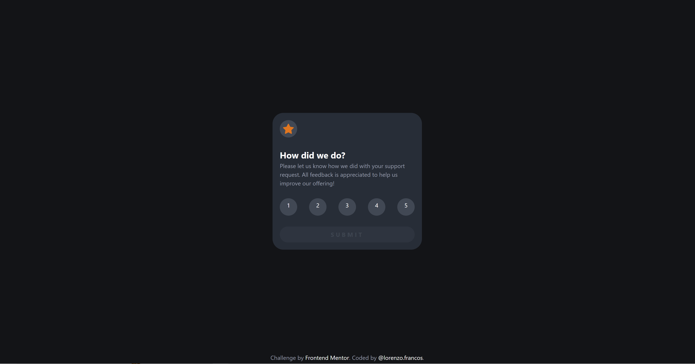

# Frontend Mentor - Interactive rating component solution

This is a solution to the [Interactive rating component challenge on Frontend Mentor](https://www.frontendmentor.io/challenges/interactive-rating-component-koxpeBUmI). Frontend Mentor challenges help you improve your coding skills by building realistic projects.

## Table of contents

- [Overview](#overview)
  - [The challenge](#the-challenge)
  - [Screenshot](#screenshot)
  - [Links](#links)
- [My process](#my-process)
  - [Built with](#built-with)
  - [What I learned](#what-i-learned)
  - [Continued development](#continued-development)
  - [Useful resources](#useful-resources)
- [Author](#author)

## Overview

### The challenge

Users should be able to:

- View the optimal layout for the app depending on their device's screen size
- See hover states for all interactive elements on the page
- Select and submit a number rating
- See the "Thank you" card state after submitting a rating

### Screenshot

### Links

- Solution URL: [here](https://github.com/Lfrancos/interactive-rating-FM-R)
- Live Site URL: [here](https://lfrancos.github.io/interactive-rating-FM-R/)

## My process

### Built with

- Semantic HTML5 markup
- CSS custom properties
- Flexbox
- Mobile-first workflow
- [React](https://reactjs.org/) - JS library
- [Styled Components](https://styled-components.com/) - For styles

### What I learned

This is the first time using React with out any guidance.

 - I learned how to start a React project.
 - I'm learning little by little what is a component. (I feel like I start to separate a lot of things when they don't need to be separated)
 - The fact that I've been trying to separate everything has showed me that for big projects it is really good, but for small projects it makes things slower. Still I keep doing it the long way cause I think that is the skill that will ultimately make a difference when working in a team.

### Continued development

This has been a really interesting experience I need to keep working and understanding a lot of things. This has been my first React project by myself the other 2 projects that I have done in React has been following a tutorial. I'm really enjoying the process there are so many things that I still need to understand but that I want to keep practicing and making mistakes to figure out what is the best way to think about components an how to organize them. I really can't believe that I'm already working with React. That is really exiting and I feel that is going to be a really interesting journey from now on : )

 -I need to understand better how to use "useEffect"
 -I added the error message but I'm not sure if that is the way to add that message. I wanted to do it using JSX but was not able to do it so I had to do it with vanilla javascript.

### Useful resources

To get to this point where I'm developing in React I've used a lot of resources, there have been 3 in particular that have helped me a ton

- [Codecademy](http://www.codecademy.com) the front-end course.
- [WebDev Simplified](https://javascriptsimplified.com/)
- [Code With Mosh](https://codewithmosh.com/courses/enrolled/324741)

## Author

- Website - [@lorenzo.francos](https://www.lorenzofrancos.com)
- Instagram - [@lorenzo.francos](https://www.instagram.com/lorenzo.francos/?hl=en)
- Github - [@Lfrancos](https://github.com/Lfrancos)
- Frontend Mentor - [@Lfrancos](https://www.frontendmentor.io/profile/Lfrancos)

---

---

---
# Getting Started with Create React App

This project was bootstrapped with [Create React App](https://github.com/facebook/create-react-app).

## Available Scripts

In the project directory, you can run:

### `npm start`

Runs the app in the development mode.\
Open [http://localhost:3000](http://localhost:3000) to view it in your browser.

The page will reload when you make changes.\
You may also see any lint errors in the console.

### `npm test`

Launches the test runner in the interactive watch mode.\
See the section about [running tests](https://facebook.github.io/create-react-app/docs/running-tests) for more information.

### `npm run build`

Builds the app for production to the `build` folder.\
It correctly bundles React in production mode and optimizes the build for the best performance.

The build is minified and the filenames include the hashes.\
Your app is ready to be deployed!

See the section about [deployment](https://facebook.github.io/create-react-app/docs/deployment) for more information.

### `npm run eject`

**Note: this is a one-way operation. Once you `eject`, you can't go back!**

If you aren't satisfied with the build tool and configuration choices, you can `eject` at any time. This command will remove the single build dependency from your project.

Instead, it will copy all the configuration files and the transitive dependencies (webpack, Babel, ESLint, etc) right into your project so you have full control over them. All of the commands except `eject` will still work, but they will point to the copied scripts so you can tweak them. At this point you're on your own.

You don't have to ever use `eject`. The curated feature set is suitable for small and middle deployments, and you shouldn't feel obligated to use this feature. However we understand that this tool wouldn't be useful if you couldn't customize it when you are ready for it.

## Learn More

You can learn more in the [Create React App documentation](https://facebook.github.io/create-react-app/docs/getting-started).

To learn React, check out the [React documentation](https://reactjs.org/).

### Code Splitting

This section has moved here: [https://facebook.github.io/create-react-app/docs/code-splitting](https://facebook.github.io/create-react-app/docs/code-splitting)

### Analyzing the Bundle Size

This section has moved here: [https://facebook.github.io/create-react-app/docs/analyzing-the-bundle-size](https://facebook.github.io/create-react-app/docs/analyzing-the-bundle-size)

### Making a Progressive Web App

This section has moved here: [https://facebook.github.io/create-react-app/docs/making-a-progressive-web-app](https://facebook.github.io/create-react-app/docs/making-a-progressive-web-app)

### Advanced Configuration

This section has moved here: [https://facebook.github.io/create-react-app/docs/advanced-configuration](https://facebook.github.io/create-react-app/docs/advanced-configuration)

### Deployment

This section has moved here: [https://facebook.github.io/create-react-app/docs/deployment](https://facebook.github.io/create-react-app/docs/deployment)

### `npm run build` fails to minify

This section has moved here: [https://facebook.github.io/create-react-app/docs/troubleshooting#npm-run-build-fails-to-minify](https://facebook.github.io/create-react-app/docs/troubleshooting#npm-run-build-fails-to-minify)
